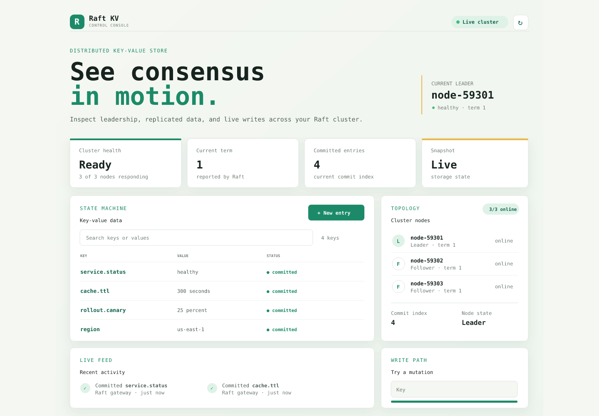

# Raft KV Store

**A distributed key-value store in C++17, built around Raft leader election and replicated log commits.** Includes a browser console, isolated dashboard accounts, JSON backup/restore, and configurable static clusters.



<p align="center"><sub>Dashboard preview of a healthy three-node cluster with live keys, node roles, and commit status.</sub></p>

## Features

- **Leader election** via Raft — term-based voting with randomized election timeouts to minimize split votes
- **Log-based replication** — writes are appended to a replicated log and only applied once confirmed by a majority of nodes
- **Automatic failover** — if the leader crashes, the remaining nodes detect the failure and elect a new leader without manual intervention
- **Automatic log catch-up** — a node that falls behind (e.g., after a restart) automatically receives and replays missing log entries
- **gRPC-based communication** — all inter-node and client-server communication uses Protocol Buffers over gRPC
- **Chaos testing** — includes a script that randomly kills and restarts cluster nodes to verify resilience
- **Durable recovery** — committed log entries and Raft election metadata survive process restarts
- **Snapshots and compaction** — committed state is periodically snapshotted to bound WAL growth
- **Optional mutual TLS** — client and peer connections can require verified certificates
- **Reloadable peer configuration** — outbound peer endpoints can be reloaded from a watched file; this is not consensus-safe Raft membership change
- **Operator console** — a responsive browser dashboard for inspecting keys and cluster activity

## Architecture

Each node in the cluster runs identical code and can be in one of three Raft states:

- **Follower** — the default state; listens for heartbeats/log entries from a leader
- **Candidate** — a node that hasn't heard from a leader within its election timeout, and is requesting votes to become leader
- **Leader** — the node currently handling client writes and replicating them to followers

Nodes communicate over gRPC using the following core RPCs (defined in `proto/kvstore.proto`):

| RPC | Purpose |
|---|---|
| `Get` / `Set` / `Delete` | Client-facing key-value operations |
| `RequestVote` | Used by candidates during leader election |
| `AppendEntries` | Used by the leader to replicate log entries and send heartbeats |
| `Heartbeat` | Lightweight liveness signal from leader to followers |

Writes flow through a **replicated log**: an entry is first appended locally, then sent to all peers. Only once a **majority** of nodes have acknowledged the entry is it marked as *committed* and applied to the in-memory key-value store — this is what guarantees consistency across the cluster even in the presence of node failures.

## Tech Stack

- **C++17**
- **gRPC** + **Protocol Buffers** for RPC and serialization
- **CMake** as the build system
- **vcpkg** for dependency management

## Getting Started

See [SETUP.md](./SETUP.md) for toolchain and cluster setup, and [TEST_SETUP.md](./TEST_SETUP.md) for automated tests and the dashboard workflow.
See [PRODUCTION_READINESS.md](./PRODUCTION_READINESS.md) for the remaining work and validation needed before production use.

### Linux and macOS

Install CMake, a C++17 compiler, gRPC, Protocol Buffers, and GoogleTest from the
platform package manager, then use the same portable commands:

```bash
cmake -S . -B build
cmake --build build --parallel
ctest --test-dir build --output-on-failure
```

Start the default three-node demo and stop all project services with:

```bash
./start.sh
./stop.sh
```

`stop.sh` stops this repository's Raft nodes, gateway, and dashboard server while preserving runtime data. Start a different static cluster by passing its distinct node ports, for example `./start.sh 50051 50052 50053 50054 50055`. See [TEST_SETUP.md](TEST_SETUP.md) for environment setup and the dashboard workflow.

### Quick overview

```powershell
# Build
cmake -S . -B build -DCMAKE_TOOLCHAIN_FILE=C:\dev\vcpkg\scripts\buildsystems\vcpkg.cmake
cmake --build build

# Run a 3-node cluster (in three separate terminals)
.\build\Debug\server.exe 50051 50052 50053
.\build\Debug\server.exe 50052 50051 50053
.\build\Debug\server.exe 50053 50051 50052

# Run the client against any node
.\build\Debug\client.exe
```

For repeatable local deployments, start a node from a config file:

```text
./build/server --config config/node.conf
```

The config supports `port`, comma-separated `peers`, `data_root`, `peers_file`,
and the TLS fields `ca`, `cert`, and `key`. Explicit command-line values override
config-file values.

### Chaos testing

```powershell
.\chaos_test.ps1
```

This starts a 3-node cluster and repeatedly kills/restarts a random node to verify the cluster recovers automatically.

## Project Structure

```
distributed-kv-store/
├── proto/
│   └── kvstore.proto        # Service and message definitions
├── server.cpp                # Raft node implementation (election + replication + KV store)
├── client.cpp                 # Simple gRPC client
├── start.sh                   # Start a configurable static cluster and dashboard
├── stop.sh                    # Stop this project's running services
├── chaos_test.ps1            # Automated resilience testing script
├── CMakeLists.txt
└── SETUP.md
```

## Runtime configuration

Each node stores its state under `data/node_<port>/`:

- `raft.meta` stores the current term and vote.
- `raft.snapshot` stores compacted state after the committed log grows sufficiently.
- `raft.wal` contains length-prefixed protobuf log records and is replayed on startup.

For mTLS, pass the CA, certificate, and private key to both servers and clients:

```powershell
.\build\Debug\server.exe 50051 50052 50053 --ca ca.pem --cert node-50051.pem --key node-50051-key.pem
.\build\Debug\client.exe --address localhost:50051 --ca ca.pem --cert client.pem --key client-key.pem
```

The server flushes committed log records to `raft.wal` before acknowledging writes.
After the compaction threshold is reached, committed state is written to
`raft.snapshot` and the obsolete WAL prefix is removed. Restart recovery loads the
snapshot first and then replays the remaining WAL suffix.

TLS configuration is intentionally strict: `ca`, `cert`, and `key` must either all
be present or all be omitted. When present, the server requires verified client
certificates and the gateway/client use the same CA trust root.

To reload membership without restarting a node, pass `--peers-file`. Put one `host:port`
per line in the file and edit it while the node is running:

```text
localhost:50052
localhost:50053
```

```powershell
.\build\Debug\server.exe 50051 --peers-file peers-50051.txt
```

The membership watcher reloads changed peer files during runtime and rebuilds the
outbound gRPC stubs without restarting the node. This does not implement Raft joint
consensus and must not be used to change the voting membership of a running cluster.
Use static membership at startup. Keep one endpoint per line and do not leave the file empty.

## Operator console

The `web/` directory contains a lightweight dashboard for exploring the store from a browser.
The Python gateway forwards browser CRUD requests to the real C++ gRPC node.

Start the default three-node demo with `./start.sh`, or pass any set of distinct node ports:

```bash
./start.sh 50051 50052 50053 50054 50055
```

The gateway targets the first node and forwards operations through Raft. Set `UI_PORT`,
`GATEWAY_PORT`, `GATEWAY_TARGET`, or `RUNTIME_DATA` to override the launcher defaults.

For isolated dashboard accounts, create a private password file and session secret before startup:

```bash
python3 create_user.py "$HOME/.config/raft-kv/users.json" alice
export GATEWAY_SESSION_SECRET="$(openssl rand -hex 32)"
USERS_FILE="$HOME/.config/raft-kv/users.json" ./start.sh 50051 50052 50053
```

Run `create_user.py` again to provision another account, then restart the gateway. Dashboard keys
are isolated per username. Without `USERS_FILE`, the local demo remains unauthenticated; do not
expose that mode to untrusted networks. Backups export one user's JSON entries; restore merges
entries and does not delete keys missing from the backup.
Existing unprefixed keys are not automatically migrated when user authentication is enabled; back
them up and migrate explicitly before switching an existing data set to accounts.

```powershell
# Terminal 1: serve the UI
python -m http.server 4173 --directory web

# Terminal 2: install and run the REST-to-gRPC gateway
python -m pip install -r requirements.txt
python gateway.py --target localhost:50051 --port 8080
```

Open `http://localhost:4173` after starting the gateway and the Raft node. The console includes
live health status, key CRUD requests, node topology, replication summary, and recent activity.
In remote environments, forward port `8080` as well as `4173`; Codespaces dashboard URLs select
the matching forwarded gateway automatically. The gateway allows authenticated dashboard requests
from the local UI and current Codespace; for another remote UI origin, add `--allowed-origin <origin>`.
The browser uses the gateway's `ListKeys` RPC and scopes dashboard accounts to separate key
prefixes. Existing unprefixed records are not automatically migrated when account mode is enabled.

The gateway also exposes `/health` for transport liveness, `/ready` for leader readiness,
`/metrics` for Prometheus-compatible request counters, `/api/nodes` for configured peer reachability,
`/api/backup` and `/api/restore` for authenticated user data backup, and `/api/cluster` for Raft
term, commit index, and leader state.

### Production Status

This project is an experimental/demo distributed store, not a production-ready database. It includes
Raft replication, persistence, snapshots, optional mutual TLS, dashboard account isolation, gateway
rate limiting, and basic metrics, but these features have not by themselves established production
reliability. Dashboard authentication does not authenticate direct gRPC clients. Keep all service
ports on trusted networks and do not store production data until the requirements and validation in
[PRODUCTION_READINESS.md](./PRODUCTION_READINESS.md) are complete.

## License

MIT. See [LICENSE](LICENSE).
